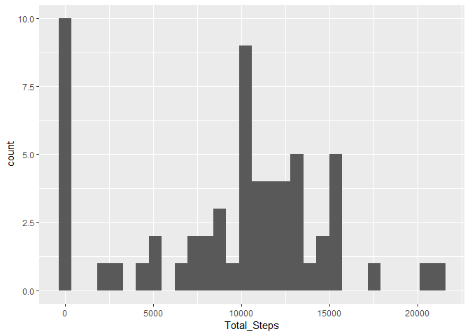
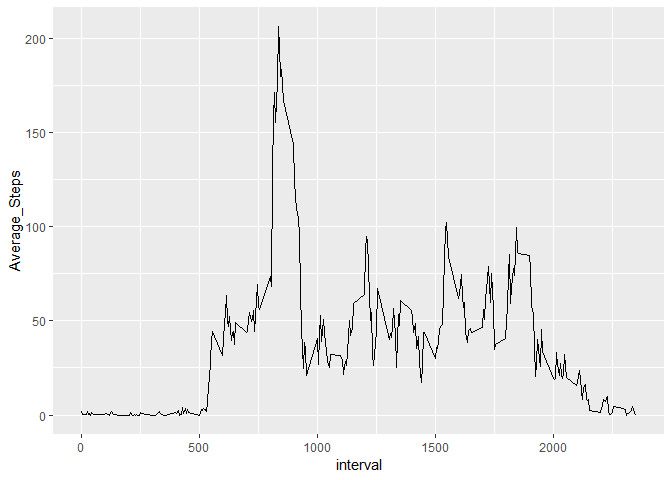
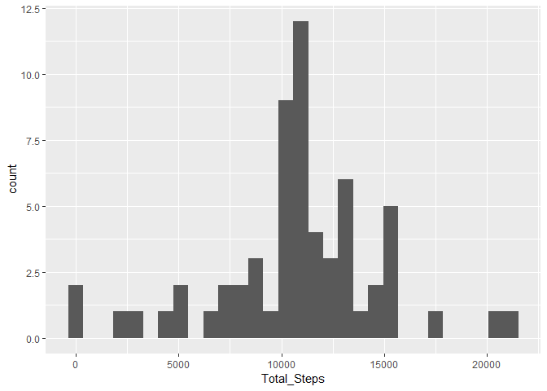
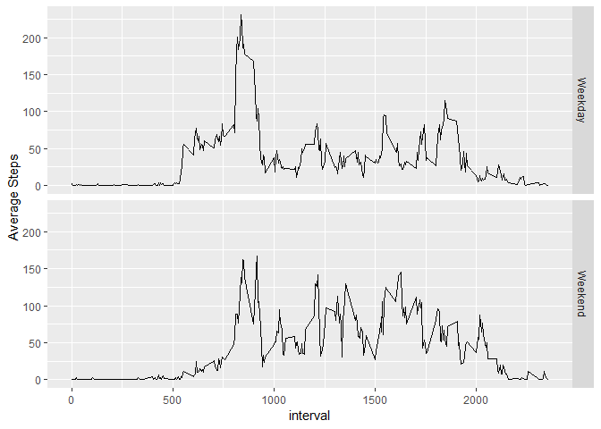

##Loading and preprocessing the data

```r
unzip('activity.zip')
activity <- read.csv('activity.csv')
```
##Loading required packages

```r
library(dplyr)
```

```
## Warning: package 'dplyr' was built under R version 3.4.3
```

```
## 
## Attaching package: 'dplyr'
```

```
## The following objects are masked from 'package:stats':
## 
##     filter, lag
```

```
## The following objects are masked from 'package:base':
## 
##     intersect, setdiff, setequal, union
```

```r
library(ggplot2)
```

```
## Warning: package 'ggplot2' was built under R version 3.4.4
```

```r
library(knitr)
```

```
## Warning: package 'knitr' was built under R version 3.4.4
```
##What is mean total number of steps taken per day?  

###Calculate the total number of steps taken per day.

```r
Day_TotalSteps <- activity %>%
  group_by(date) %>%
  summarize(Total_Steps = sum(steps, na.rm = T))
Day_TotalSteps
```

```
## # A tibble: 61 x 2
##    date       Total_Steps
##    <fct>            <int>
##  1 2012-10-01           0
##  2 2012-10-02         126
##  3 2012-10-03       11352
##  4 2012-10-04       12116
##  5 2012-10-05       13294
##  6 2012-10-06       15420
##  7 2012-10-07       11015
##  8 2012-10-08           0
##  9 2012-10-09       12811
## 10 2012-10-10        9900
## # ... with 51 more rows
```
###Make a histogram of the total number of steps taken each day

```r
ggplot(Day_TotalSteps, aes(Total_Steps)) +
  geom_histogram()
```

```
## `stat_bin()` using `bins = 30`. Pick better value with `binwidth`.
```

<!-- -->

###Calculate and report the mean and median of the total number of steps taken per day  


```r
Day_TotalSteps %>%
  summarize(Mean_StepsPerDay = mean(Total_Steps),
            Median_StepsPerDay = median(Total_Steps))
```

```
## # A tibble: 1 x 2
##   Mean_StepsPerDay Median_StepsPerDay
##              <dbl>              <int>
## 1            9354.              10395
```
##What is the average daily activity pattern?  

###Make a time series plot (i.e. type="l") of the 5-minute interval (x-axis) and the average number of steps taken, averaged across all days (y-axis)  


```r
AvgSteps_PerInterval <- activity %>%
  group_by(interval) %>%
  summarize(Average_Steps = mean(steps, na.rm = T))
ggplot(AvgSteps_PerInterval, aes(interval, Average_Steps)) +
  geom_line()
```

<!-- -->

###Which 5-minute interval, on average across all the days in the dataset, contains the maximum number of steps?

```r
AvgSteps_PerInterval$interval[AvgSteps_PerInterval$Average_Steps == max(AvgSteps_PerInterval$Average_Steps)]
```

```
## [1] 835
```
##Imputing missing values  

###Calculate and report the total number of missing values in the dataset (i.e. the total number of rows with NAs)

```r
sum(is.na(activity))
```

```
## [1] 2304
```
##Devise a strategy for filling in all of the missing values in the dataset  

###Use mean of intervals

```r
Mean_byInterval <- activity %>%
  group_by(interval) %>%
  summarize(meanbyinterval = mean(steps, na.rm = T))
activity_imputed <- merge(activity, Mean_byInterval, 'interval', all.x = T )
```
###Create a new dataset that is equal to the original dataset but with the missing data filled in.

```r
activity_imputed$steps[is.na(activity_imputed$steps)] <- activity_imputed$meanbyinterval[is.na(activity_imputed$steps)]
```
###Make a histogram of the total number of steps taken each day and Calculate and report the mean and median total number of steps taken per day.

```r
Day_TotalSteps_Imputed <- activity_imputed %>%
  group_by(date) %>%
  summarize(Total_Steps = sum(steps, na.rm = T))
Day_TotalSteps_Imputed
```

```
## # A tibble: 61 x 2
##    date       Total_Steps
##    <fct>            <dbl>
##  1 2012-10-01      10766.
##  2 2012-10-02        126.
##  3 2012-10-03      11352.
##  4 2012-10-04      12116.
##  5 2012-10-05      13294.
##  6 2012-10-06      15420.
##  7 2012-10-07      11015.
##  8 2012-10-08      10766.
##  9 2012-10-09      12811.
## 10 2012-10-10       9900.
## # ... with 51 more rows
```

```r
ggplot(Day_TotalSteps_Imputed, aes(Total_Steps)) +
  geom_histogram()
```

```
## `stat_bin()` using `bins = 30`. Pick better value with `binwidth`.
```

<!-- -->

```r
Day_TotalSteps_Imputed %>%
  summarize(Mean_StepsPerDay = mean(Total_Steps),
            Median_StepsPerDay = median(Total_Steps))
```

```
## # A tibble: 1 x 2
##   Mean_StepsPerDay Median_StepsPerDay
##              <dbl>              <dbl>
## 1           10766.             10766.
```
###Do these values differ from the estimates from the first part of the assignment? What is the impact of imputing missing data on the estimates of the total daily number of steps?  

*Answer: Both the mean and median have increased, especially the mean.*  

##Are there differences in activity patterns between weekdays and weekends? Use the dataset with the filled-in missing values for this part.  

###Create a new factor variable in the dataset with two levels - "weekday" and "weekend" indicating whether a given date is a weekday or weekend day.

```r
activity_imputed$Time_of_Week <- weekdays(as.Date(activity_imputed$date))
weekend <- c("Saturday", "Sunday")
activity_imputed$Time_of_Week <- ifelse(activity_imputed$Time_of_Week %in% weekend, "Weekend", "Weekday")
```
###Make a panel plot containing a time series plot (i.e. type="l") of the 5-minute interval (x-axis) and the average number of steps taken, averaged across all weekday days or weekend days (y-axis).

```r
Final_Summary <- activity_imputed %>%
  group_by(Time_of_Week, interval) %>%
  summarize(`Average Steps` = mean(steps))

ggplot(Final_Summary, aes(interval, `Average Steps`)) +
  geom_line() +
  facet_grid(Time_of_Week~.)
```

<!-- -->
